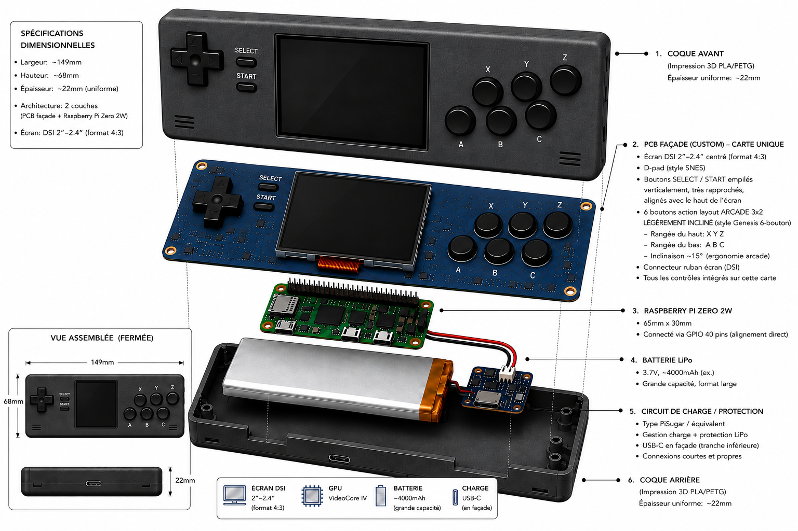

# Retro Gaming Handheld

> A DIY retro gaming handheld built around the Raspberry Pi Zero 2W — my personal vehicle for learning PCB design, power delivery, and mechanical tolerances from scratch.


---



---

## What this is

This is not a kit and not a product — it's a scratch-built handheld game console I'm designing to learn things. The goal isn't really a finished device (though that would be nice); it's to get hands-on with:

- **PCB design** — custom façade board in KiCad, manufactured at JLCPCB
- **Power delivery** — safe LiPo charging and protection with a TP4056 circuit
- **Mechanical tolerances** — designing a printed enclosure that actually fits
- **Embedded Linux** — RetroPie configuration on a constrained platform

If the end result also plays Pokémon, that's a bonus.

---

## Hardware

| Component | Part | Notes |
|-----------|------|-------|
| SBC | Raspberry Pi Zero 2W | 1GHz quad-core, ~30×65mm |
| Display | 2.4" SPI (ILI9341, TBD) | 320×240, FBTFT (`fb_ili9341`) |
| PCB façade | Custom — KiCad → JLCPCB | Houses buttons, routes inputs to Pi |
| Battery | 3.7V LiPo ~4000mAh | Large-format cell, sized to enclosure |
| Charge/protect | TP4056 module | CC/CV charging + over-discharge protection |
| Boost converter | 5V boost module (TBD) | Steps up 3.7V LiPo to 5V for the Pi |
| Enclosure | Bambu Lab FDM print | ~149×68×22mm, PLA or PETG |
| Buttons | 2×3 diagonal action layout | A/B/X/Y + L/R style arrangement |
| OS | RetroPie | RPi OS Bookworm (32-bit), FBTFT (`fb_ili9341`) |

---

## Project Phases

### Phase 1 — Design
- [ ] Finalize overall dimensions and display placement
- [ ] Lay out button matrix and ergonomics
- [ ] Size battery compartment to ~4000mAh cell
- [ ] Confirm Pi Zero 2W mounting strategy

### Phase 2 — PCB Façade
- [ ] Schematic in KiCad (button matrix, GPIO routing)
- [ ] PCB layout with JLCPCB DRC rules
- [ ] Fab order and first article review
- [ ] Rework / rev 2 if needed

### Phase 3 — Enclosure
- [ ] CAD model in Bambu Studio / Fusion 360
- [ ] Print iteration 1 — fit check only
- [ ] Refine tolerances around display, PCB, battery
- [ ] Final print with desired finish

### Phase 4 — Assembly
- [ ] Wire power circuit: LiPo cell to TP4056 B+/B− (charging input); boost converter to TP4056 OUT+/OUT− (protected discharge output); boost 5V output to Pi
- [ ] Seat PCB façade and display
- [ ] Close enclosure
- [ ] Smoke test

### Phase 5 — Software
- [ ] Flash **Raspberry Pi OS (Legacy, 32-bit) — Bookworm** to microSD (Trixie/Debian 13 FBTFT+RetroPie compatibility unverified — see ADR-0004)
- [ ] Install RetroPie on top via the RetroPie installer script
- [ ] Configure FBTFT dtoverlay for ILI9341 in `/boot/firmware/config.txt` (SPI bus, GPIO pins, bus speed) — exact overlay syntax to be confirmed against RPi OS documentation
- [ ] Map button inputs
- [ ] Load a ROM or two and actually play something

---

## Current Status

**Phase 1 — Design** (active)

Starting with the physical layout. Figuring out where everything fits before committing to PCB dimensions or CAD geometry.

---

## Repo Structure

```
retro-gaming-handheld/
├── docs/
│   ├── adr/        # Architecture Decision Records
│   └── ...         # Notes, references, wiring diagrams
├── kicad/          # Schematic + PCB layout project files
├── stl/            # Enclosure and bracket STL/3MF files
└── images/         # Photos, renders, assembly diagrams
```

---

## Why document it here?

Mostly for myself — so I can track decisions and re-read why I made them. If it's useful to someone else building something similar, great.

---

## License

[MIT](LICENSE)
