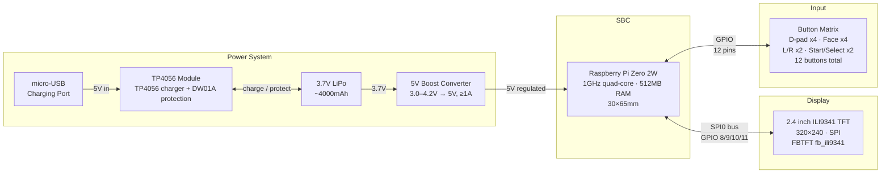
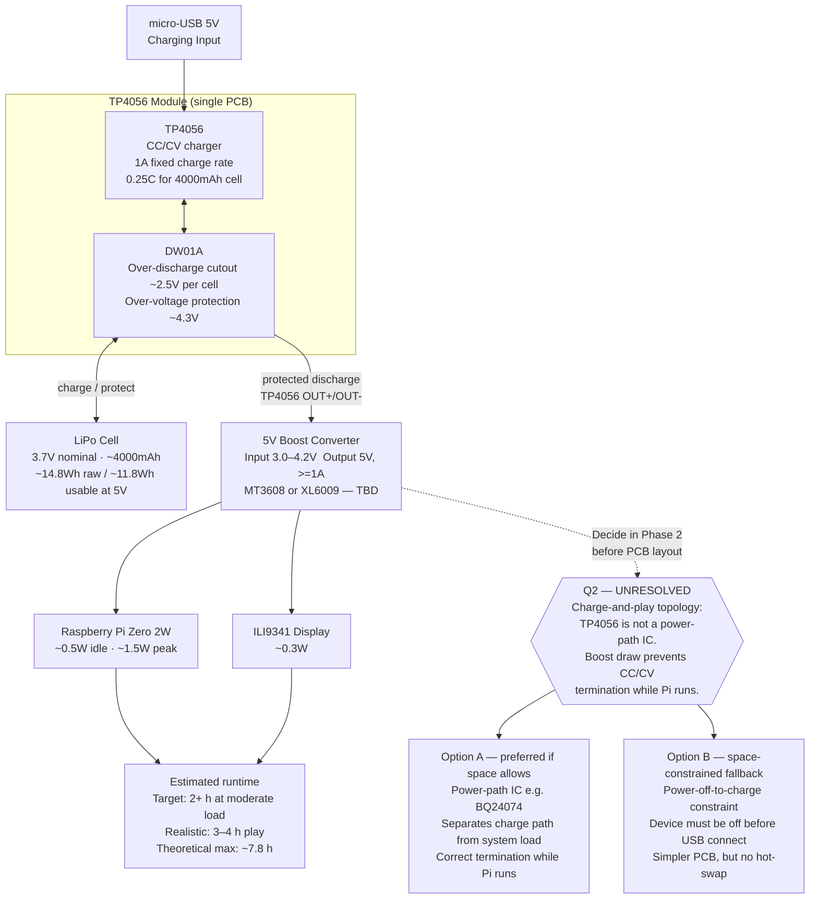
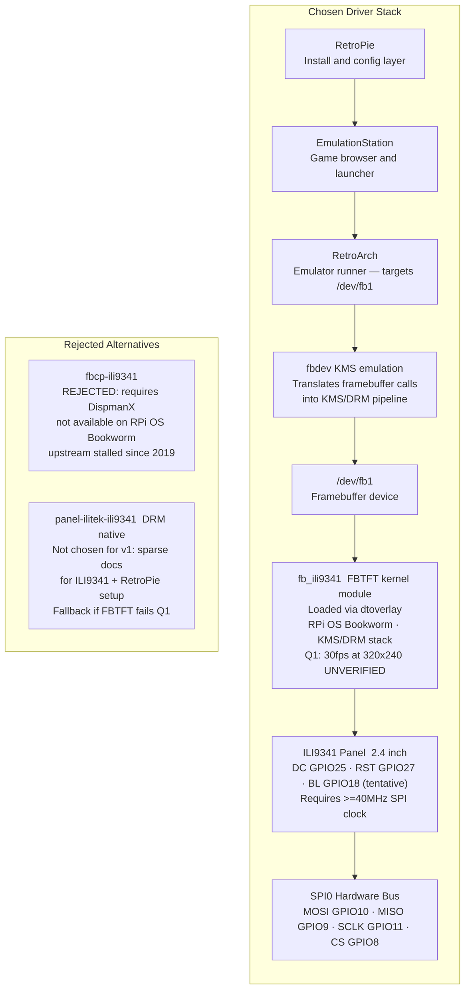
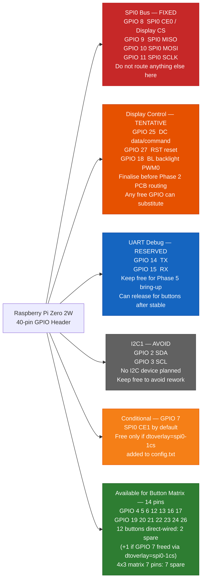
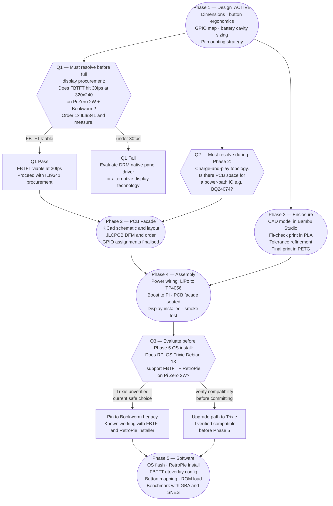
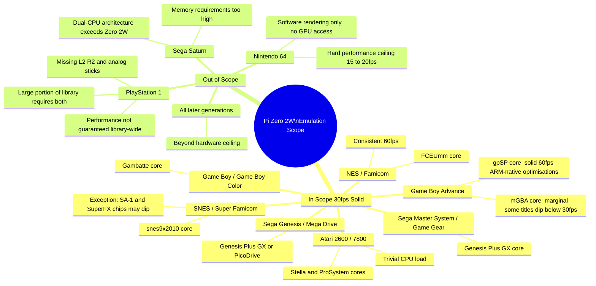

# Diagrams

Visual overviews of the retro gaming handheld architecture. All diagrams are Mermaid and render on GitHub.

---

## 1. System Architecture Overview

Top-level hardware block diagram showing how all components connect.

---

## 2. Power Delivery Topology

Detailed power path from battery cell through protection, boost conversion, and load. The **Q2 open question** (charge-and-play topology) is shown as an unresolved decision branch that must be resolved before Phase 2 PCB layout.

---

## 3. Display Driver Software Stack

Software and kernel layers from the SPI hardware bus up to the RetroPie UI. Rejected driver alternatives are shown separately.

---

## 4. GPIO Pin Allocation

Pi Zero 2W GPIO pins grouped by assignment. Power and GND pins omitted. Pins 27/28 (HAT EEPROM) are not general-purpose GPIO and are excluded.

**Legend:** 🔴 Fixed (hardware SPI0) · 🟠 Tentative (confirm before routing) · 🔵 Reserved (UART debug) · ⬛ Avoid (I2C, keep free) · 🟡 Conditional (needs dtoverlay override) · 🟢 Available (button matrix)

---

## 5. Project Phases and Dependencies

Phase 1 through Phase 5 with the three open questions (Q1, Q2, Q3) shown as explicit blockers.

---

## 6. Emulation Scope

Systems supported at 30fps vs explicitly out of scope, with the reasoning for each exclusion.

